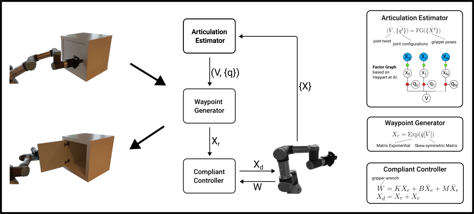

# EEF cabinet manipulation
This is the codebase for an [ICRA 23 workshop paper](https://tlpss.github.io/revisiting-proprioception-for-articulated-manipulation/) on using proprioceptive sensing for articulated object manipulation. See the [website](https://tlpss.github.io/revisiting-proprioception-for-articulated-manipulation/) for more details.


## High-level overview of the codebase
```
ROS/src/
    fzi-cartesian-controllers   # Cartesian controllers for ROS-control based robot drivers
    ure_cartesian_controllers   # launch file and config for using ^ on the UR robots
airo-mono/                      # packages for using cameras, spatial algebra etc.
cabinet-robot/                  # actual code for opening cabinets
cat-ind-fg/                     # code for articulation estimation, which is a  fork of the FG method from Heppert et Al.
```


## Using this codebase to open articulated objects
### Setting up the Robot
running this code requires a UR e-series robot and a robotiq gripper. If you have another position-controlled robot with a F/T sensor, you will have to find ROS drivers for it and change the launch and config files in the `ure_cartesian_controllers` package.

To run the code on your robot setup:
- have your robot configured for ROS control, see [the driver setup guide](https://docs.ros.org/en/ros2_packages/rolling/api/ur_robot_driver/installation/robot_setup.html). Follow the network setup and robot preparation sections. Make sure you can ping the robot.
- create a polyscope installation where you configure the CoM and weight of your gripper, so that the measured wrench will be gravity-compensated by the UR controlbox.

### Setting up the software

- clone this repo and pull the submodules `git submodule init && git submodule update`
- manually install some apt packages that are required: `sudo apt-get install -y libsuitesparse-dev libboost-all-dev libcholmod3`
- create the conda environment `conda env create -f environment.yaml`


### running the ROS docker image
The ROS stack is encapsulated in a docker image, so that you don't need to do a system install of ROS on your workstation if you don't want to. Communication to the ROS docker container is done using websockets, as provided by the ROS-Webbridge packages.


**using prebuilt docker image**
- run `xhost + local:` to share the X11 socket with the docker container
- start the docker container with the ROS stack in a separate terminal:
`docker run  -e DISPLAY=$DISPLAY -v /tmp/.X11-unix:/tmp/.X11-unix --gpus all -p 10.42.0.1:50002:50002 -p 127.0.0.1:9090:9090 -it tlpss/ros-ure-fzi-admittance:galactic`. This will map the ROS2 webbridge to the host machine on port 9090. This is required to communicate with the ROS2 nodes from outside the docker container. It will also map the port for the UR driver to the host machine on port 50002. This is required to communicate with the UR robot. The first two configurations are to share the display so that RVIZ can be used to visualize the robot.
The UR in RVIZ should have the same pose as the real UR robot. Check for any errors in the launch logs as well.

- in the docker container terminal run `bash scripts/ure-fzi-start-script.sh` to start the ROS nodes. RVIZ should now spin up and the visualized robot should be in the same configuration as your real robot.
- run the external control program on the polyscope, this should show the following logs in the container:
```
[ur_ros2_control_node-1] [INFO] [1677166593.336590025] [UR_Client_Library]: Robot requested program
[ur_ros2_control_node-1] [INFO] [1677166593.336708205] [UR_Client_Library]: Sent program to robot
[ur_ros2_control_node-1] [INFO] [1677166593.549108827] [UR_Client_Library]: Robot connected to reverse interface. Ready to receive control commands.
```

 As soon as this is started you are ready to control the robot using the `cabinet_robot/robot.py` module.

### Opening articulated objects
run `python cabinet_robot/open_cabinet.py`. You will be asked to move the robot to the grasp pose, which you can do by pausing the external control program. After this, you can press enter and the robot will open the grasped articulated object.
## Development

### Running formatting, linting and testing
- (initialize the pre-commit hooks `pre-commit install`)
- The makefile contains commands to make this convenient. Run using `make <command>`.

### ROS docker stack
This sections assumes basic knowledge about ROS 2, ros2_control.

The docker container runs the following ROS packages
- ROS2 UR drivers to communicate with the UR robot
- FZI cartesian controllers
- ROS2 webbridge to allow the python modules outside of the docker container to communicate with JSON messages
- You can run rqt in a separate terminal on the docker container using `docker attach <container-name>`. This can be used to set parameters for the cartesian controllers, send messages manually or check which controllers are active at the moment.
- If the robot.py module is not behaving as it should, send messages manually to the target_pose topics and check that the controllers are activated. Read the log output of the ros nodes carefully to check for warnings/errors.  This can be done with rqt or using the ROS2 CLI. Make sure that the dummy node talker an subscriber can communicate with each other. If not, check the network configuration of the docker container.

#### building the docker image
`docker build ROS/ -t ros-fzi-admittance`

#### pushing image to dockerhub
to persist the image, push it to dockerhub. If you don't do this the behavior of the image might change due to updates in the dependencies!

`docker tag ros-fzi-admittance tlpss/ros-ure-fzi-admittance:galactic`
`docker push tlpss/ros-ure-fzi-admittance:galactic`

#### note on docker networking
Note: using `network=host` in docker, as you will often see online, caused me some issues. Nodes were not able to communicate with eachother, even within the same container. I'm not exactly sure why this is the case, but I'm guessing it has something to to with the multiple network interfaces on the workstation as I did not have these issues on my laptop. Therefore I opted for the bridge network and manually mapped the relevant ports.

#### note on ROS humble
when using the same launch file with ros humble, the `controller_manager` crashes without any error message.


## Citation
If you use this codebase, please cite our paper:
```
@inproceedings{lips2023proprioceptive-articulated-manipulation,
        author    = {Lips, Thomas and wyffels, Francis},
        title     = {Revisiting Proprioceptive Sensing for Articulated Object Manipulation},
        booktitle = {Embracing Contacts workshop - IEEE International Conference on Robotics and Automation 2023 (ICRA)},
        year = {2023},
      }
```